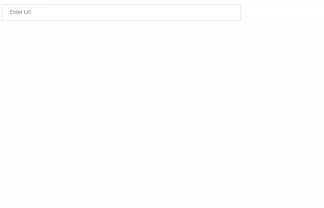

# AngularJS - URL Component

An AngularJS based URL component provides option to add url (like Instagram url, Facebook url, web url, etc.) with validation. The URL value is automatically validated on change event. You can even disable url field using disable props.

## Table of contents

- [Browser Support](#browser-support)
- [Demo](#demo)
- [Getting started](#getting-started)
- [Usage](#usage)
- [Available Props](#available-props)
- [Methods](#methods)
- [Want to Contribute?](#want-to-contribute)
- [Collection of Components](#collection-of-components)
- [Changelog](#changelog)
- [License](#license)
- [Keywords](#Keywords)

## Browser Support

|  |  |  |  |  |
| ---------------------------------------------------------------------------------------- | ------------------------------------------------------------------------------------------- | ---------------------------------------------------------------------------------------- | ---------------------------------------------------------------------------------- | ---------------------------------------------------------------------------------------------------------------------------- |
| 83.0 ✔                                                                                   | 77.0 ✔                                                                                      | 13.1.1 ✔                                                                                 | 83.0 ✔                                                                             | 11.9 ✔                                                                                                                       |

## Demo

[](https://github.com/weblineindia/AngularJS-URL-Component/urlNg.gif)

## Getting started

Install the npm package:

```bash
npm install angular-weblineindia-url
#OR
yarn add angular-weblineindia-url
```

## Usage

Use the `<angular-weblineindia-url>` component:

```typescript

// File: example.module.ts

import { NgModule } from "@angular/core";
import { UrlModule } from "angular-weblineindia-url";

@NgModule({
  imports: [UrlModule]
})
export class AppModule {}
```

```typescript
// File: example.component.ts

export class AppComponent {
  user: any = {
    value: "",
    placeholder: "Enter Url",
    name: "facebookUrl",
    id: "facebookUrl",
    disabled: "false",
    tabindex: "1",
    urltype: "instagram",
    urlErrorName: "The url entered is not valid and must be changed",
    facebookUrlRegex: /(?:(?:http|https):\/\/)?(?:www.)?facebook.com\/(?:(?:\w)*#!\/)?(?:pages\/)?(?:[?\w\-]*\/)?(?:profile.php\?id=(?=\d.*))?([\w\-]*)?/
  };

  onChange(event) {
    if (event.target.value.trim() === "") {
      this.user.value = event.target.value
        .replace(/^[^-\s][a-zA-Z0-9_\s-]+$/, "")
        .trim();
    } else {
      this.user.value = event.target.value;
    }
  }

  onFocus(event) {
    event.target.placeholder = "";
  }
  onBlur(event) {
    event.target.placeholder = this.user.placeholder;
  }
}
```

```html
// File: example.component.html

<lib-url
  [placeholder]="user.placeholder"
  [name]="user.name"
  [value]="user.value"
  [id]="user.id"
  [disabled]="user.disabled"
  [tabindex]="user.tabindex"
  [urlErrorName]="user.urlErrorName"
  [urltype]="user.urltype"
  [regex]="user.facebookUrlRegex"
  (change)="onChange($event)"
  (focus)="onFocus($event)"
  (blur)="onBlur($event)"
>
</lib-url>
```

## Available Props

| Prop         | Type    | default                                          | Description                                                                                                                                                                            |
| ------------ | ------- | ------------------------------------------------ | -------------------------------------------------------------------------------------------------------------------------------------------------------------------------------------- |
| value        | String  |                                                  | url value                                                                                                                                                                              |
| urlErrorName | String  | The url entered is not valid and must be changed | error value for url                                                                                                                                                                    |
| regex        | RegExp  |                                                  | input regex default is for facebook.                                                                                                                                                   |
| placeholder  | String  | Enter Url                                        | url placeholder                                                                                                                                                                        |
| disabled     | Boolean | false                                            | disable url field                                                                                                                                                                      |
| name         | String  | facebookUrl                                      | name for url field                                                                                                                                                                     |
| tabindex     | Number  | 1                                                | url tabIndex                                                                                                                                                                           |
| id           | String  | facebookUrl                                      | name for url field                                                                                                                                                                     |
| urltype      | String  | 'facebook'                                       | Default url type for component 'facebook' you can pass 'instagram','web','linkedin','other'.based on that regex will set.if you pass other you have to pass regex value which you want |

## Methods

| Name   | Description                                             |
| ------ | ------------------------------------------------------- |
| focus  | Gets triggered when the url input field receives focus. |
| blur   | Gets triggered when the url input field loses focus.    |
| change | Gets triggered every time url got changed.              |

## Want to Contribute?

- Created something awesome, made this code better, added some functionality, or whatever (this is the hardest part).
- [Fork it](http://help.github.com/forking/).
- Create new branch to contribute your changes.
- Commit all your changes to your branch.
- Submit a [pull request](http://help.github.com/pull-requests/).

---

## Collection of Components

We have built many other components and free resources for software development in various programming languages. Kindly click here to view our [Free Resources for Software Development](https://www.weblineindia.com/software-development-resources.html)

---

## Changelog

Detailed changes for each release are documented in [CHANGELOG.md](./CHANGELOG.md).

## License

[MIT](LICENSE)

[mit]: https://github.com/weblineindia/AngularJS-URL-Component/blob/master/LICENSE

## Keywords

angular-weblineindia-url,url,angularjs components,angularjs,angularjs component
